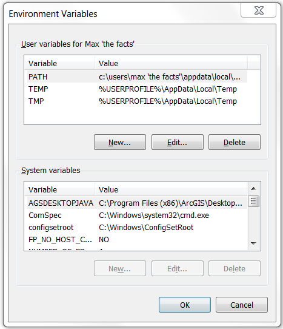
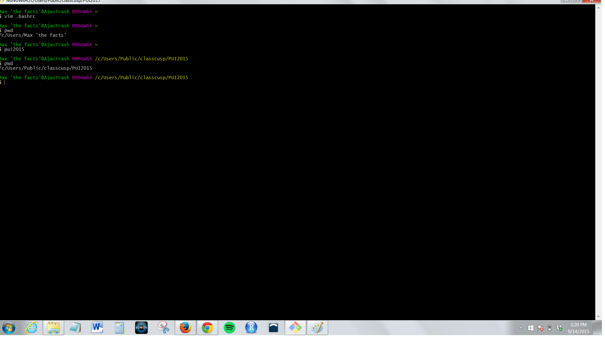
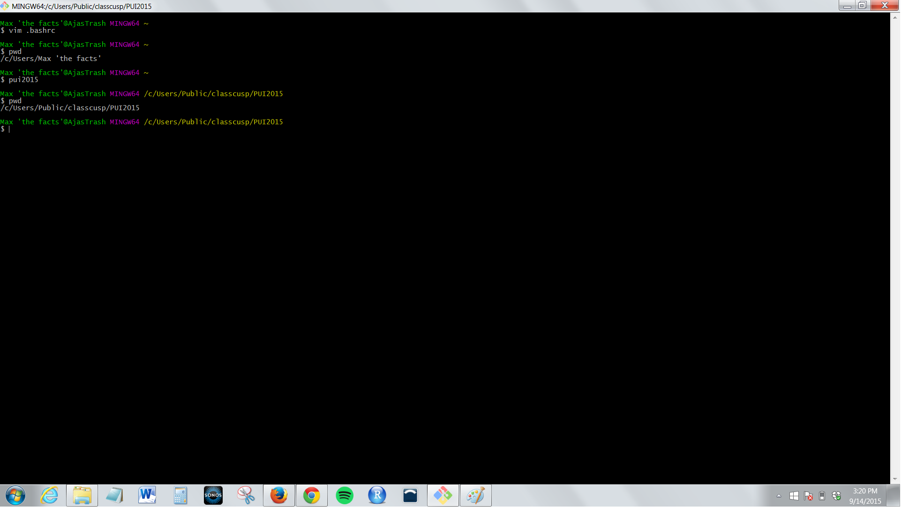

# PUI2015_mfeinglass

First, I created an environmental variable.  This was hard as I did not realize that I needed to do it in Windows, as opposed to Git-Bash.  
But, I figured it out.

Then, I edited my my .bashrc file using the VM text editor.  I created an alias using the environmental variable created
in the first step.

Finally I tested my alias in the git-bash command line, and it worked!

